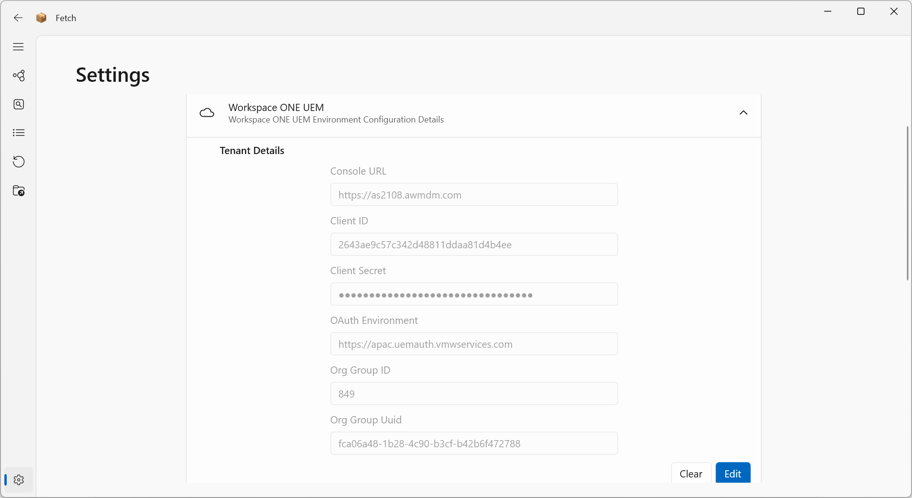

## Required Settings

Upon first time run, you will need to enter the following settings.

 

|                		|Description                    |Notes                         |
|-----------------------|-------------------------------|-----------------------------|
|Console URL			|Your UEM environment API Server (eg. https://as1234.awmdm.com)|Ensure you use _`asXXXX`_ not _`cn`_ or _`ds`_ |
|Client ID				|An OAuth Client ID generated from the UEM Console||
|Client Secret			|An OAuth Client Secret generated from the UEM Console||
|OAuth Environment URL	|Your region’s OAuth Environment|Find yours [here](https://docs.vmware.com/en/VMware-Workspace-ONE-UEM/2209/UEM_ConsoleBasics/GUID-BF20C949-5065-4DCF-889D-1E0151016B5A.html)|
|File Download Path		|Enter a location where the downloaded installers should to be saved to (eg. C:\temp\Downloads)|Installers will stay here until they are manually deleted|

**_NOTE:_** 
No trailing slashes on any of the URLs or filepaths as per examples. OAuth environments will eventually be a selection box._
Upon saving, the Org Group ID and Org Group Uuid will be obtained from the UEM environment.

**_IMPORTANT:_** 
These settings are currently saved in `C:\Users\{your_username}\AppData\Local\Fetch\ApplicationData\LocalSettings.json`
**Ensure security of this file**. Later versions of Fetch will save these secrets to the registry using Windows’s Data Protection APIs.