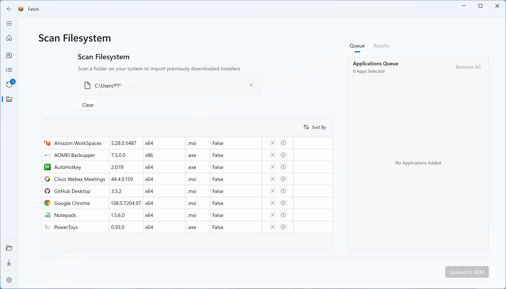

## Scan Folder of Downloaded Apps

On all pages that download application installers, there is a "Download Only" option. This allows you to only download the installers for further testing etc.

To complete the upload of these applications once downloaded, you can go to the 'Scan Folder' page and select the location where your previously downloaded installers are saved.

This will then scan the selected folder **recursively** and import the application (and its metadata) into Fetch ready to be uploaded to Workspace ONE UEM.

>### ℹ️ Important
>{: .no_toc }
>
> When downloading installers in "Download Only" mode, Fetch saves the files in the following structure:  
> `{Your_Saved_Download_Path}\{PackageIdentifier}\{Version}\{Architecture}\{FileType}\{Filename}`
> 
> Alongside this file, Fetch also creates a `metadata.json` file that contains the information needed to create the application in UEM. If you _delete_ this file, the application cannot be imported in to Fetch using this method.
>

>### ℹ️ Note
>{: .no_toc }
> 
> This is process is only intended to import applications downloaded using Fetch. If you want to upload your own applications/installers, use the Local Source Applications process.

