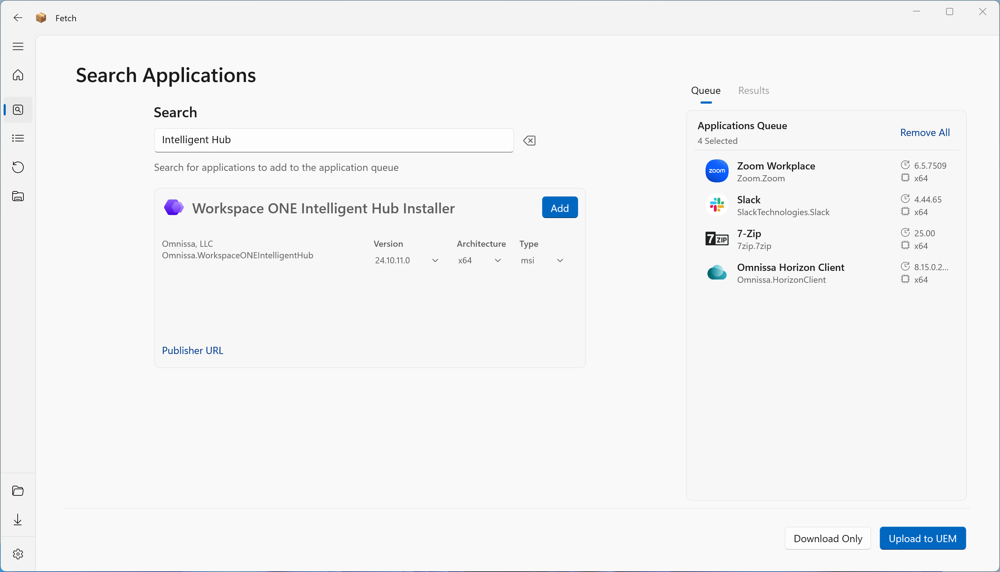
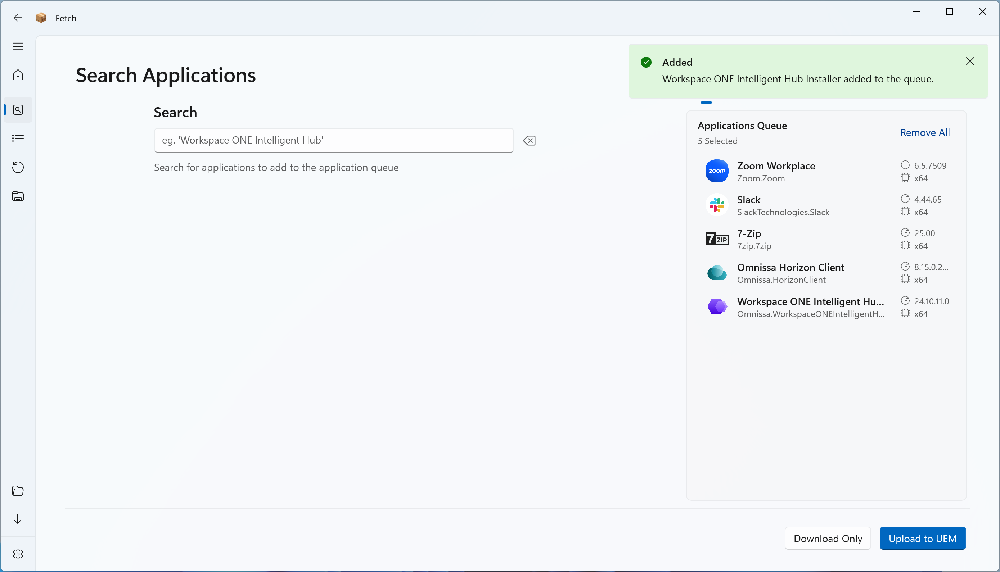
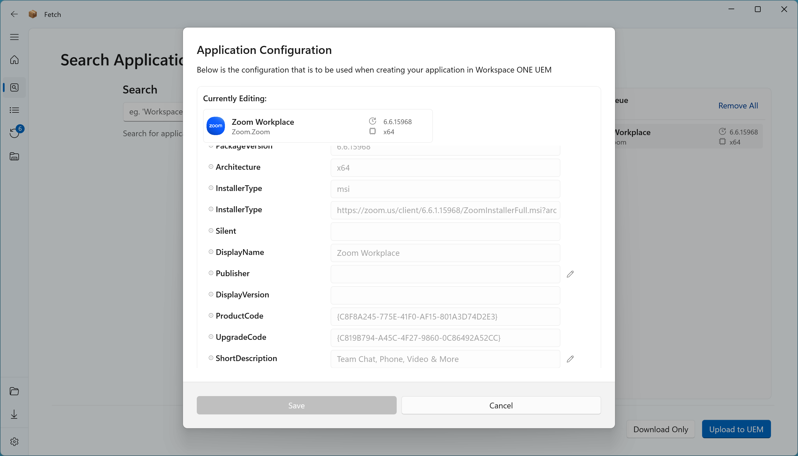
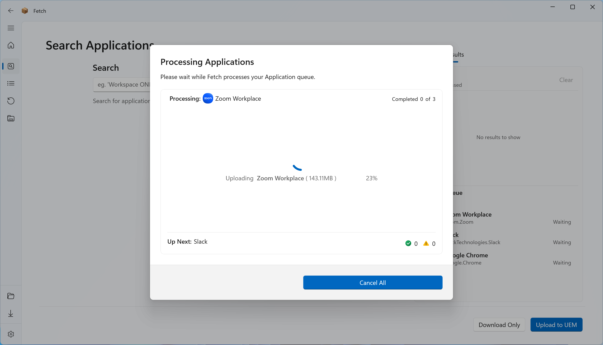

## Searching for Applications

The simplest way to use Fetch is to use the Search Applications functionality.

Upon searching and finding a result, an Administrator can see details provided by the Software Vendor about the application, choose the version, architecture and filetype (if multiple exist) and then add it to the upload queue.

>### ℹ️ Notes
> {: .no_toc }
> 
> Application Search results default to:
> - The latest version available
> - x64 (then x86, then arm64) architecture
> - .msi installer type if they exist, otherwise it will default to .exe
> - Changing any of these results re-evaluates the available options:
>   - **e.g.** _If a user changes the version selected in the dropdown list, it will then attempt to set the other options of the dropdowns to the defaults mentioned above._

 

## Queuing Multiple Applications
You can queue multiple applications from each page and have them upload sequentially.

## Editing Application Parameters

Once you have added an application to the queue, you can right-click on the Application entry and either remove it from the queued items or edit the default Configuration Parameters used to create the application in the Workspace ONE Catalog.

>### ℹ️ Notes
> {: .no_toc }
> When editing the application configuration, you can enable the text fields options by clicking the edit button next to the entry.

## Uploading Apps

When you have queued your applications, you can select either 'Download Only' or 'Upload to UEM' to process the queue. Download Only mode will _only_ download the installers allowing you to scan or process them later. Upload to UEM will download the application install and automatically upload and create the application in the Workspace ONE UEM Application Catalog.

>### ℹ️ Notes
> {: .no_toc }
> Uploading an application to UEM will not assign it to any Assignment Group. You must manually add the assignments from the Workspace ONE UEM Admin Console.

 
 